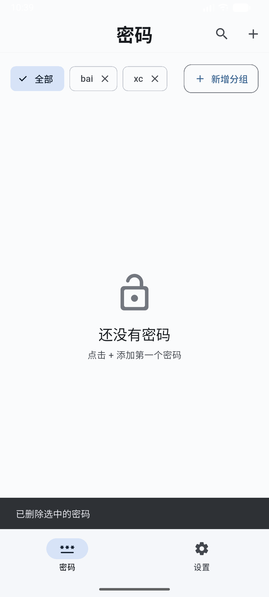
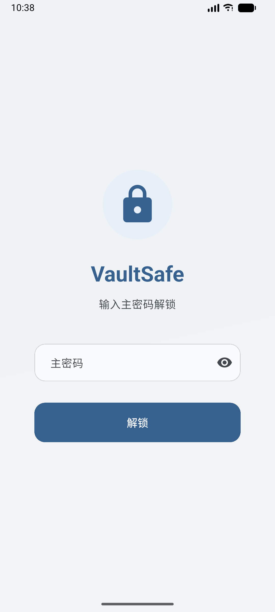
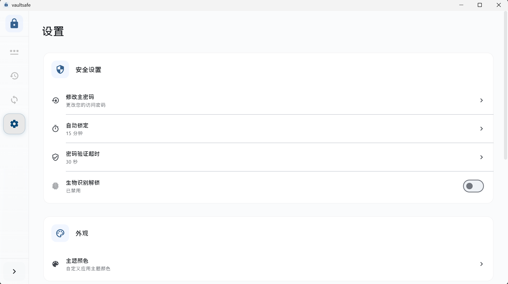
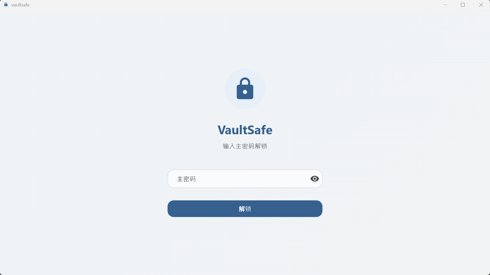
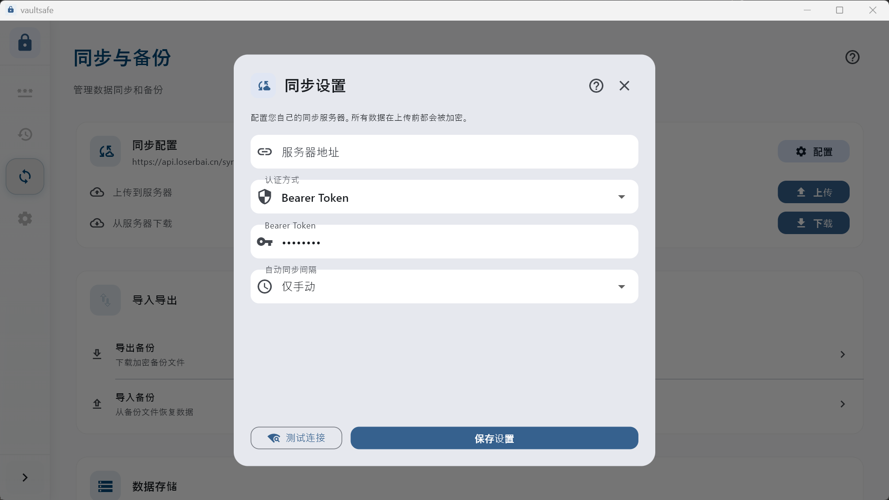
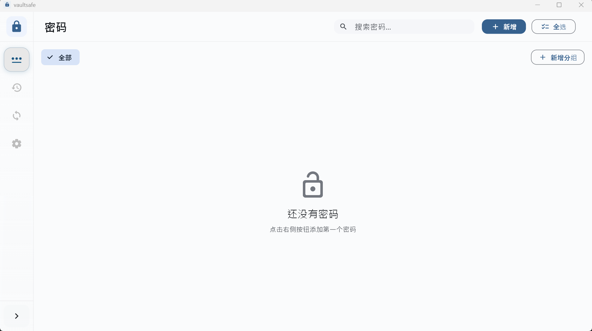

# 🔒 VaultSafe — End-to-End Encrypted Password Manager

> **Secure · Private · Cross-Platform · End-to-End Encryption**

[](https://github.com/yourusername/vaultsafe/releases)
[](https://flutter.dev)
[](https://dart.dev)
[](LICENSE)

**VaultSafe** is an open-source, secure, cross-platform password manager built with Flutter. All sensitive data is encrypted locally on your device using your master key - **servers cannot decrypt any data**. Supports complete offline usage with optional encrypted cloud sync.

**Current Version**: 1.0.1 | [更新日志](CHANGELOG.md)

## 📱 应用截图

### 移动端



### PC 桌面





---

## ✨ Core Features

- 🔐 **End-to-End Encryption (E2EE)**: All data encrypted locally using PBKDF2-HMAC-SHA256 + AES-256-GCM
- 🌐 **Cross-Platform**: Single codebase for iOS, Android, Web, Windows, macOS, Linux
- 📦 **Password Management**:
  - Create, read, update, delete password entries
  - Copy usernames and passwords to clipboard
  - Secure password viewing with toggle visibility
  - **Password verification required** for viewing, copying, and editing (v1.0.1)
  - **Configurable verification timeout** (10s/30s/1m/5m/15m) (v1.0.1)
  - Password generator utility (available for UI integration)
- 🗂️ **Group Management**: Organize passwords into folders
- ⚙️ **Settings Center**:
  - Change master password (with password strength validation)
  - Enable/disable sync
  - Import/export encrypted backups (JSON format)
  - Auto-lock timeout configuration
  - Custom data directory selection
  - Biometric authentication toggle (UI ready, integration in progress)
  - **Password verification timeout configuration** (v1.0.1)
- 🔄 **Third-Party Sync** (Foundation):
  - Configure custom sync endpoints
  - Multiple authentication methods (Bearer Token, Basic Auth, Custom Headers)
  - Manual sync trigger
  - Connection testing
- 🛡️ **Zero-Knowledge Architecture**: Server only stores encrypted blobs, cannot access plaintext
- 💾 **Data Persistence**: Hive-based encrypted local storage with automatic recovery on app restart
- ⚡️ **Performance Optimization**:
  - **Async key derivation using Isolates** - UI never freezes (v1.0.1)
  - **100,000 PBKDF2 iterations** without blocking main thread (v1.0.1)
- 📁 **Unified Data Storage**:
  - **All app data in one directory** (`vault_safe_data/`) (v1.0.1)
  - **Automatic config migration** from old versions (v1.0.1)

---

## 🛠 Tech Stack

- **Framework**: Flutter 3.24+ (Dart 3.5+)
- **State Management**: Riverpod (v2.5.1) + StateNotifier
- **Local Storage**:
  - **Hive** (v2.2.3) - Lightweight NoSQL database for encrypted data storage
  - **Hive Flutter** (v1.1.0) - Flutter integration for Hive
  - **flutter_secure_storage** (v9.2.2) - Secure storage for sensitive data (master key, tokens)
  - **shared_preferences** (v2.3.2) - Simple key-value pairs for app settings
  - **path_provider** (v2.1.3) - Cross-platform file system paths
- **Encryption**: `pointycastle` (v3.9.1) + `crypto` (v3.0.3) (PBKDF2 + AES-256-GCM)
- **Concurrency**: Dart Isolates (for async key derivation in v1.0.1)
- **Network**: `dio` (v5.7.0) + custom sync protocol
- **File Picker**: `file_picker` (v8.1.2) for backup import/export
- **Biometrics**: `local_auth` (v2.3.0) (Face ID / Touch ID / Windows Hello)
- **UI**: Material 3 Design System

---

## 📂 Project Structure

```
lib/
├── main.dart
├── core/
│   ├── encryption/       # Encryption core (key derivation, AES-GCM)
│   ├── sync/             # Sync engine with third-party API support
│   ├── backup/           # Backup/restore service
│   ├── storage/          # Hive-based encrypted local storage
│   └── security/         # Security policies
├── features/
│   ├── auth/             # Master password setup, authentication, unlock flow
│   ├── passwords/        # Password management UI & logic
│   ├── profile/          # Profile screen
│   ├── settings/         # Settings center (password, sync, backup)
│   └── home/             # Home screen with navigation
├── shared/
│   ├── models/           # Data models (PasswordEntry, PasswordGroup, Settings)
│   ├── providers/        # Riverpod providers (auth, passwords, settings)
│   ├── utils/            # Utilities (password generator, etc.)
│   └── platform/         # Platform-specific services
└── components/           # Reusable UI components
```

---

## 🚀 Getting Started

### Prerequisites

- Flutter SDK 3.24 or higher
- Dart 3.5 or higher

### Install Dependencies

```bash
flutter pub get
```

### Run on Different Platforms

```bash
# Mobile
flutter run -d android
flutter run -d ios

# Web
flutter run -d chrome --web-renderer html

# Desktop
flutter run -d windows
flutter run -d macos
flutter run -d linux
```

---

## 🔐 Encryption Design

### Master Key Generation

1. User sets a **Master Password** (minimum 8 characters)
2. Key is derived using **PBKDF2-HMAC-SHA256** with 100,000 iterations
3. Results in a **32-byte (256-bit) Master Key**
4. Master key **never leaves the device**

### Data Encryption

- Each password entry encrypted with **AES-256-GCM** (authenticated encryption)
- Random **12-byte nonce** generated for each encryption
- Encrypted structure:
```json
{
  "nonce": "base64...",
  "ciphertext": "base64...",
  "tag": "base64..."
}
```
- All data Base64 encoded before storage

### Storage Architecture

#### Hive NoSQL Database
VaultSafe uses **Hive** as a primary local storage solution - a fast, lightweight key-value database optimized for Flutter.

**Data Organization (Boxes)**:
```
vault_safe_data/
├── passwords.hive        # Encrypted password entries
├── groups.hive           # Encrypted group data
├── settings.hive         # Application settings
└── hive.lock             # File lock for concurrent access
```

**Key Features**:
- **Encrypted Boxes**: All data stored in Hive is pre-encrypted using AES-256-GCM
- **Three Storage Boxes**:
  - `passwords` - Stores all password entries (each encrypted individually)
  - `groups` - Stores folder/group organization
  - `settings` - Stores app configuration
- **Custom Directory Support**: Users can choose custom storage location
- **Write Permission Verification**: Automatic validation before initialization
- **Automatic Recovery**: Data persists across app restarts
- **Cross-Platform**: Works seamlessly on iOS, Android, Windows, macOS, Linux

**Default Storage Paths**:
- **Windows**: `%APPDATA%\vault_safe_data`
- **macOS**: `~/Library/Application Support/vaultsafe_data`
- **Linux**: `~/.local/share/vaultsafe_data`
- **Android**: `/data/data/<user>/flutter.vaultsafe_data`
- **iOS**: `<AppHome>/Documents/vaultsafe_data`

#### Secure Storage Layer

Sensitive information is stored using platform-specific secure storage:

- **Android Keystore**: Hardware-backed key store for master key and sync tokens
- **iOS Keychain**: Encrypted storage for sensitive credentials
- **Windows/Desktop**: Encrypted file-based storage

**What's Stored Securely**:
- Master password-derived encryption keys
- Third-party sync authentication tokens
- Device identifiers for sync
- Biometric authentication preferences

#### Simple Configuration Storage

- **SharedPreferences**: Lightweight key-value storage for:
  - UI preferences (theme, auto-lock timeout)
  - Feature flags (biometric enabled, sync enabled)
  - Last sync timestamp
- - User preferences

### Data Flow

1. **User creates/edits password** → Encrypts with AES-256-GCM → Stores in Hive `passwords` box
2. **User changes settings** → Updates Hive `settings` box (if sensitive) or SharedPreferences (if non-sensitive)
3. **Sync token received** → Encrypts with master key → Stores in flutter_secure_storage
4. **App restart** → Hive initializes all boxes → Data automatically available

---

## 🔄 Sync Configuration (Third-Party APIs)

VaultSafe supports syncing encrypted data to your own servers. All sync data is **AES-256-GCM encrypted** - third-party services cannot read content.

### Supported Authentication Methods

| Method | Description |
|--------|-------------|
| **Bearer Token** | JWT or API token in Authorization header |
| **Basic Auth** | Username and password authentication |
| **Custom Headers** | Custom HTTP headers (e.g., `X-API-Key`) |

### Sync Protocol (REST API)

Your sync server needs to implement these two endpoints:

#### Upload Encrypted Data (POST)
```http
POST /api/v1/sync
Authorization: Bearer <token>
Content-Type: application/json

{
  "device_id": "uuid-string",
  "timestamp": 1705742400,
  "encrypted_data": "base64_encrypted_blob",
  "version": "1.0"
}
```

#### Download Encrypted Data (GET)
```http
GET /api/v1/sync
Authorization: Bearer <token>

Response:
{
  "device_id": "other-device-id",
  "timestamp": 1705742500,
  "encrypted_data": "base64_encrypted_blob",
  "version": "1.0"
}
```

> **Note**: The server only returns the `encrypted_data` field. VaultSafe handles conflict resolution by keeping the latest timestamp.

---

## 📦 Backup & Restore

### Export Backup

1. Go to **Settings** > **Export Backup**
2. Backup will be encrypted using your master password
3. File saved to device's Downloads folder (or platform-specific location)
4. Filename format: `vaultsafe_backup_YYYY-MM-DDTHH-MM-SS.json`

### Import Backup

1. Go to **Settings** > **Import Backup**
2. Select your backup file (.json)
3. Preview backup information (version, encryption status, size, date)
4. Confirm import to restore data

> ⚠️ **Warning**: Importing a backup will overwrite existing data. Export current data first!

---

## 🏗️ Development Status

**Current Version**: **1.0.1** (2025-02-05)

### ✅ Implemented Features (v1.0.1)
- [x] Master password setup and authentication
- [x] **Async key derivation** (UI never freezes)
- [x] **Password verification for sensitive operations** (view, copy, edit)
- [x] **Configurable verification timeout**
- [x] Password CRUD operations
- [x] Group/folder management
- [x] Encrypted local storage (Hive)
- [x] Import/export encrypted backups
- [x] Change master password
- [x] Auto-lock timeout settings
- [x] Third-party sync configuration
- [x] Password generator utility
- [x] Custom data directory selection
- [x] Detailed logging for debugging
- [x] **Unified data directory structure**
- [x] **Automatic config migration**
- [x] **Improved error handling** for update service
- [x] **Friendly error messages** for network issues

### 🚧 In Progress
- [ ] Biometric authentication integration
- [ ] Auto-sync timer implementation
- [ ] Password strength indicator
- [ ] Password generator UI integration

### ✅ Implemented Features
- [x] Device list management
- [ ] Security event logging
- [ ] Theme switching (dark/light)
- [ ] Drag-and-drop group reordering
- [ ] Conflict detection and resolution
- [ ] Incremental sync
- [ ] Auto-fill integration (mobile)
- [ ] Anti-screenshot protection
- [ ] Unit tests (encryption, sync)
- [ ] Isar database migration (optional)

---

## 🔒 Security Architecture

### Zero-Knowledge Proof

- **Master Password**: Never stored or transmitted
- **Encryption Keys**: Derived locally, never leave device
- **Sync Credentials**: Encrypted with master key before storage
- **Server Data**: Only stores encrypted blobs (AES-256-GCM)

### Secure Storage

- **Android Keystore** / **iOS Keychain**: For sensitive data
- **Hive Encrypted Boxes**: All data pre-encrypted using AES-256-GCM
- **Flutter Secure Storage**: For sync tokens and device ID

### What's Stored Securely

- Master password-derived encryption keys
- Third-party sync authentication tokens
- Device identifiers for sync
- Biometric authentication preferences

---

## 🐛 Troubleshooting

### Data Not Persisting After Restart

If you experience data loss after app restart:

1. **Check logs** - Look for `StorageService:` debug messages showing:
   - Data directory path
   - Hive initialization status
   - Number of passwords/groups loaded

2. **Verify permissions** - The app needs write access to:
   - `getApplicationDocumentsDirectory()/vault_safe_data` (default)
   - Custom directory if configured

3. **Export backup regularly** - Use Settings > Export Backup to create encrypted backups
   - This protects against data loss

### Common Issues

- **"StorageService not initialized"**: Restart app
- **"Directory not writable"**: Check app permissions or choose a different directory
- **"Sync failing"**: Use "Test Connection" button in sync settings

---

## 📜 License

This project is licensed under **MIT License** - see [LICENSE](LICENSE) file for details.

---

## 🙌 Contributing

Contributions are welcome! Please ensure:
- New features don't compromise encryption security
- Code follows existing style and patterns
- Sensitive data handling is properly documented
- Tests are added for critical functionality (encryption, sync)

### 📋 Resources

- **Issues**: Report bugs and feature requests on GitHub Issues
- **Documentation**: See `CLAUDE.md` for detailed Chinese documentation
- **Changelog**: See [CHANGELOG.md](CHANGELOG.md) for version history and updates

---

## 📋 Changelog

### **[1.0.1]** (2025-02-05)
- ✨ Password verification for sensitive operations (view, copy, edit)
- ⚡ Async key derivation (UI never freezes)
- 📁 Unified data directory structure
- 🐛 Improved error handling
